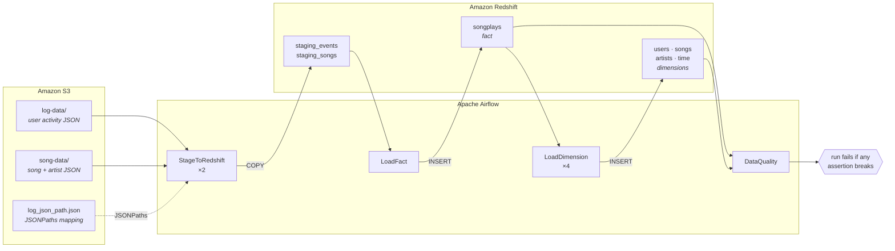
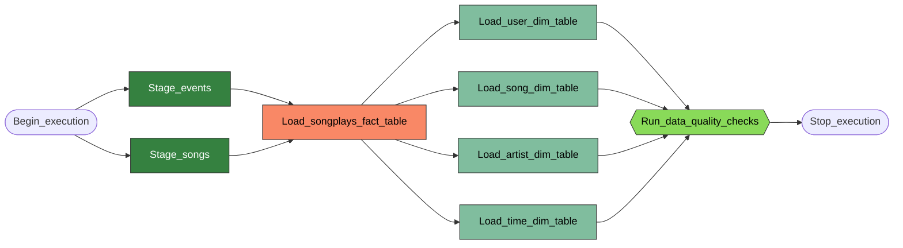
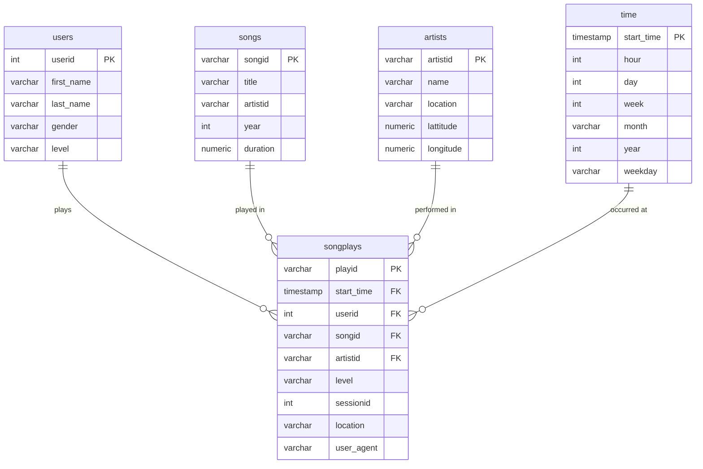

# Data Pipelines with Airflow — Sparkify

<p align="left">
  
  
  
  
</p>

An hourly Apache Airflow pipeline that lifts Sparkify's raw JSON event logs and
song metadata out of S3, stages them in Amazon Redshift, reshapes them into a
star schema, and refuses to finish unless the result passes a set of data
quality assertions.

Built for the Udacity **Data Engineering with AWS** nanodegree, using four
custom operators rather than a wall of `PostgresOperator` tasks.

---

## Table of contents

- [The problem](#the-problem)
- [Architecture](#architecture)
- [The DAG](#the-dag)
- [Data model](#data-model)
- [The custom operators](#the-custom-operators)
- [Data quality gate](#data-quality-gate)
- [Getting started](#getting-started)
- [Project layout](#project-layout)
- [Design notes](#design-notes)

---

## The problem

Sparkify, a music streaming startup, has outgrown hand-run ETL scripts. Their
analytics warehouse needs pipelines that are:

| Requirement | How this project answers it |
| --- | --- |
| **Automated** | An `@hourly` DAG, no manual triggers |
| **Reusable** | Four parametrized operators, zero hard-coded SQL in Python |
| **Monitorable** | Every operator logs what it did and how many rows it moved |
| **Backfillable** | Templated S3 keys resolve per execution date |
| **Trustworthy** | A quality gate that fails the run when the data is wrong |

The source data is two S3 prefixes of newline-delimited JSON: user activity
logs, and song/artist metadata. The destination is a Redshift star schema that
analysts can query without touching raw JSON.

---

## Architecture



Airflow never handles a row of data itself. It orchestrates; Redshift does the
work. `COPY` moves S3 → staging in parallel inside Redshift, and every
transformation is an `INSERT INTO … SELECT` that stays server-side. The
operators only build statements, execute them through a hook, and log the
outcome.

---

## The DAG



Four stages, with parallelism wherever the data allows it:

1. **Stage** — both `COPY` jobs run concurrently; they touch different tables.
2. **Fact** — `songplays` joins the two staging tables, so it waits for both.
3. **Dimensions** — all four run concurrently. `time` is derived *from
   songplays*, which is why no dimension can start before the fact load
   commits.
4. **Gate** — quality checks run last and fail the run if the warehouse is
   wrong.

### Configuration

```python
default_args = {
    'owner': 'sparkify',
    'depends_on_past': False,      # a failed run must not block the next one
    'retries': 3,
    'retry_delay': timedelta(minutes=5),
    'email_on_retry': False,
}
```

with `start_date` explicit, `schedule_interval='@hourly'`, `catchup=False` and
`max_active_runs=1` so overlapping runs can't fight over the same tables.

---

## Data model

`create_tables.sql` builds two staging tables and the star schema below.



The `SELECT` bodies feeding each table live in
[`plugins/helpers/sql_queries.py`](plugins/helpers/sql_queries.py). The
operators wrap them in `INSERT`; they never contain SQL of their own beyond
`TRUNCATE` and `COUNT`.

---

## The custom operators

All four live in [`plugins/operators/`](plugins/operators) and share the same
shape: take parameters, build a statement, run it through an Airflow hook, log
what happened.

### `StageToRedshiftOperator`

Loads any JSON prefix from S3 into any Redshift table.

```python
StageToRedshiftOperator(
    task_id='Stage_events',
    table='staging_events',
    s3_bucket=S3_BUCKET,
    s3_key=f'{S3_PREFIX}log-data',
    json_path=f's3://{S3_BUCKET}/{S3_PREFIX}log_json_path.json',
    extra_copy_options="TIMEFORMAT AS 'epochmillisecs'",
)
```

| Parameter | Purpose |
| --- | --- |
| `table` | Destination staging table |
| `s3_bucket`, `s3_key` | Source location — **templated** |
| `json_path` | `auto`, or an `s3://` JSONPaths file — **templated** |
| `truncate_before_load` | Empty the table first (default `True`) so re-runs are idempotent |
| `region`, `extra_copy_options` | Region, plus any extra `COPY` clauses |

Two details worth calling out:

- **`json_path` is what tells the two JSON layouts apart.** Song files map
  field-for-field, so Redshift infers the mapping with `auto`. Event logs
  don't — their keys don't match the column names — so they need an explicit
  JSONPaths file. Same operator, different argument.
- **`s3_bucket` / `s3_key` are `template_fields`.** That is what makes
  backfills real. Swap the key for
  `"log-data/{{ execution_date.strftime('%Y/%m') }}"` and each run loads only
  its own interval; re-running a past date re-loads that date's files.

Credentials are pulled from the `aws_credentials` connection through
`AwsBaseHook` and injected into the `COPY`. The rendered statement is
**deliberately never logged** — it contains the AWS secret key.

### `LoadFactOperator` and `LoadDimensionOperator`

Both take a table and a `SELECT` body and assemble the `INSERT` themselves. The
difference is entirely in the defaults, which encode how each kind of table
behaves:

| | `LoadFactOperator` | `LoadDimensionOperator` |
| --- | --- | --- |
| Default mode | **Append-only** | **Truncate-insert** |
| Why | Facts are huge and accumulate | Dimensions are small and rebuilt from staging each run |
| `truncate_before_load` | `False` — set `True` for a full rebuild | `True` — set `False` for append-only |

`truncate_before_load` is the switch the rubric asks for: the DAG can move a
dimension to append-only without editing a line of operator code.

The dimension's `TRUNCATE` and `INSERT` run in **one transaction**, so a failed
insert leaves the previous contents intact instead of an emptied table.

### `DataQualityOperator`

See below.

---

## Data quality gate

The operator has no tests inside it. The DAG passes them in as data:

```python
DataQualityOperator(
    task_id='Run_data_quality_checks',
    dq_checks=[
        {
            'description': 'songplays fact table is not empty',
            'check_sql': 'SELECT COUNT(*) FROM songplays',
            'expected_result': 0,
            'comparison': '>',
        },
        {
            'description': 'every songplay has a user',
            'check_sql': 'SELECT COUNT(*) FROM songplays WHERE userid IS NULL',
            'expected_result': 0,          # comparison defaults to '=='
        },
        # ...
    ],
)
```

`comparison` accepts `==`, `!=`, `>`, `>=`, `<`, `<=`, because real assertions
are a mix of *"this must be zero"* and *"this must not be zero"*.

**Every check runs before anything is raised.** A single task run reports all
the failures at once rather than stopping at the first — much faster to debug
than fixing one problem per retry. The exception is raised at the end, which
makes Airflow retry the task three times and then fail the run.

The six checks currently shipped cover emptiness, referential nulls on the fact
table, null primary keys on the dimensions, and uniqueness of the time key.

---

## Getting started

### 1. Prerequisites

- Docker Desktop
- An AWS account with an IAM user (programmatic access) and a **Redshift
  Serverless** workgroup that is publicly accessible

### 2. Copy the datasets into your own bucket

The Udacity bucket lives in `us-west-2`. Copy it to a bucket in the same region
as your Redshift workgroup — otherwise `COPY` is slow or fails outright. From
AWS CloudShell:

```bash
aws s3 mb s3://<your-bucket>

aws s3 cp s3://udacity-dend/log-data/  ~/log-data/  --recursive
aws s3 cp s3://udacity-dend/song-data/ ~/song-data/ --recursive
aws s3 cp s3://udacity-dend/log_json_path.json ~/

aws s3 cp ~/log-data/  s3://<your-bucket>/log-data/  --recursive
aws s3 cp ~/song-data/ s3://<your-bucket>/song-data/ --recursive
aws s3 cp ~/log_json_path.json s3://<your-bucket>/

aws s3 ls s3://<your-bucket>/
```

### 3. Create the warehouse tables

Run [`create_tables.sql`](create_tables.sql) in the Redshift query editor. It
drops and recreates all seven tables, so it is safe to re-run.

### 4. Configure and start Airflow

```bash
cp .env.example .env    # then fill in your AWS keys, bucket and Redshift host
docker compose up -d
```

The UI comes up at <http://localhost:8080> — log in with `airflow` / `airflow`.

### 5. Register connections and variables

```bash
docker compose exec airflow-scheduler bash /opt/airflow/set_connections_and_variables.sh
```

The script reads your `.env`, which `docker-compose.yaml` mounts into the
container alongside it.

This creates what the DAG expects:

| Name | Type | Purpose |
| --- | --- | --- |
| `aws_credentials` | Connection (Amazon Web Services) | IAM key/secret for the `COPY` |
| `redshift` | Connection (Postgres) | Redshift host, port, db, user, password |
| `s3_bucket` | Variable | Your bucket name |
| `s3_prefix` | Variable | Optional prefix inside the bucket |

You can also create these by hand in **Admin → Connections / Variables** — the
script just saves the clicking.

### 6. Run it

Unpause `final_project` in the UI and trigger it. A clean run turns all nine
tasks green; a broken warehouse turns `Run_data_quality_checks` red with every
failed assertion listed in the task log.

---

## Project layout

```
.
├── dags/
│   └── final_project.py            # the DAG: config, tasks, dependencies, DQ checks
├── plugins/
│   ├── helpers/
│   │   └── sql_queries.py          # all SELECT bodies for the star schema
│   └── operators/
│       ├── stage_redshift.py       # S3 → Redshift COPY
│       ├── load_fact.py            # append-only fact load
│       ├── load_dimension.py       # truncate-insert dimension load
│       └── data_quality.py         # parametrized assertion runner
├── create_tables.sql               # staging + star schema DDL
├── docker-compose.yaml             # local Airflow 2.8.1 (CeleryExecutor)
├── set_connections_and_variables.sh
└── .env.example
```

---

## Design notes

A few decisions that aren't obvious from the code alone.

**Variables are read through Jinja, not `Variable.get()`.** The DAG file sets
`S3_BUCKET = "{{ var.value.get('s3_bucket', 'udacity-dend') }}"`. Calling
`Variable.get()` at module level would query the metadata database on *every
scheduler parse* — every few seconds, forever. Deferring to Jinja means the
lookup happens once per task run, at execution time.

**Nothing is hard-coded that a parameter could carry.** Table names, S3
locations, JSONPaths, load mode and the quality checks themselves are all
arguments. The four operator classes contain no knowledge of Sparkify; point
them at different tables and they run a different warehouse.

**Load modes are defaults, not rules.** Facts append and dimensions
truncate-insert because that is right *most* of the time, not always. Both are
one keyword argument away from the other behaviour.

**Reserved words are quoted to match the DDL.** `level`, `year`, `hour`, `day`,
`month` and the `time` table itself are quoted in the generated `INSERT`
column lists, mirroring `create_tables.sql`.

**Row counts are logged after every load.** `COPY` and `INSERT` are silent
about volume by default. Logging the resulting count turns the Airflow task log
into a usable record of what each run actually moved — which is the difference
between a pipeline you can monitor and one you merely hope is working.
